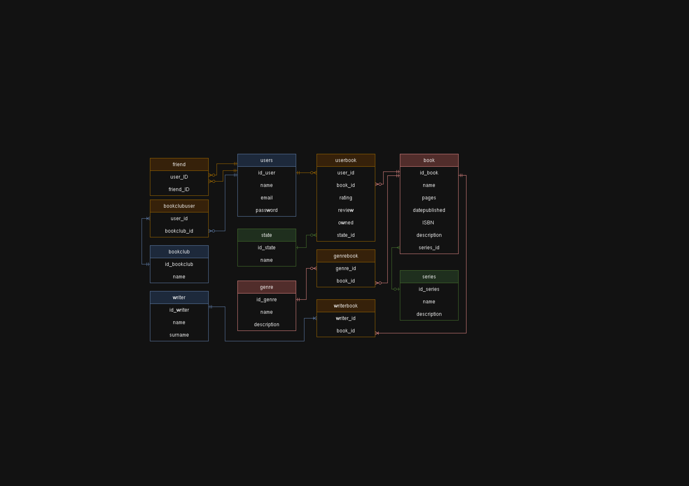

Relační Databáze pro BetterReads

Tento repozitář obsahuje SQL skripty pro vytvoření a správu relační databáze v PostgreSQL. Databáze je navržena pro sociální platformu podobnou [BetterReads](https://github.com/ValdemarPospisil/BetterReads), ale zde používáme relační model namísto Neo4j.
Funkce:
    Vytváření Tabulek: Skripty pro vytvoření tabulek ukládajících data o uživatelích, knihách a jejich vztazích.
    Naplnění Daty: Skripty pro vložení ukázkových dat.
    Příklady Dotazů: Různé SQL příkazy demonstrující načítání, aktualizaci dat a správu uživatelů.
    Správa Uživatelů: Procedury a dotazy pro operace související s uživateli.

Účel:
  Databáze slouží jako backend pro sociální síť zaměřenou na knihy, autory a interakce uživatelů, podobně jako BetterReads. 
  Tato implementace však používá PostgreSQL namísto grafové databáze Neo4j, která je využívána v projektu BetterReads.
  
Diagram Entit a Vztahů

