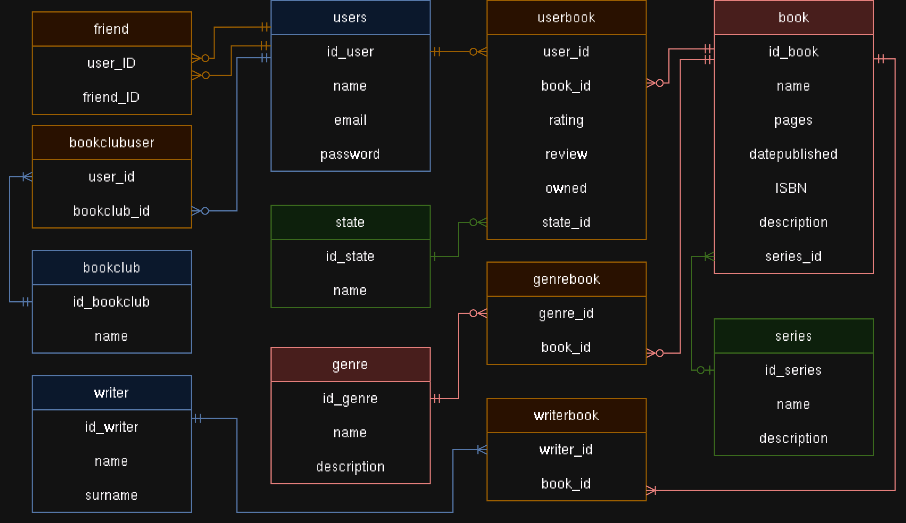

Relační Databáze pro BetterReads

Tento repozitář obsahuje SQL skripty pro vytvoření a správu relační databáze v PostgreSQL.
Funkce:
    Vytváření Tabulek: Skripty pro vytvoření tabulek ukládajících data o uživatelích, knihách a jejich vztazích.
    Naplnění Daty: Skripty pro vložení ukázkových dat.
    Příklady Dotazů: Různé SQL příkazy demonstrující práci s daty (např. SELECT, FUNCTION, PROCEDURE)
    Správa Uživatelů: Příkazy pro operace související s uživateli.

Účel:
  Databáze slouží jako backend pro sociální síť zaměřenou na knihy, autory a interakce uživatelů, podobně jako BetterReads. 
  Tato implementace však používá PostgreSQL namísto grafové databáze Neo4j, která je využívána v projektu [BetterReads](https://github.com/ValdemarPospisil/BetterReads).
  
Diagram Entit a Vztahů

